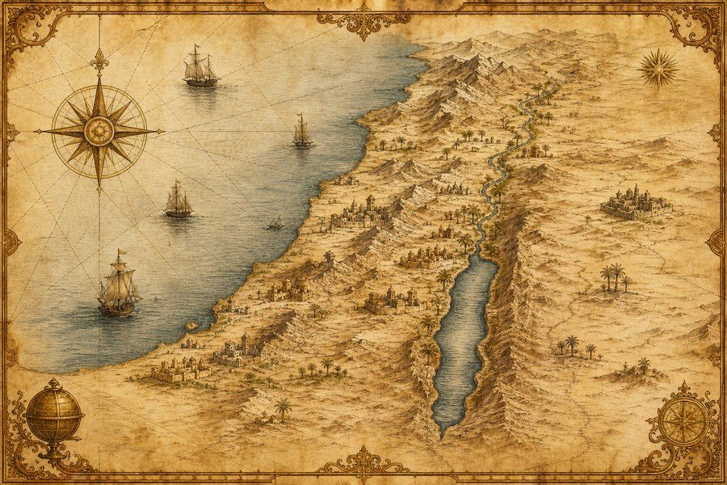

# Renacer · Atlas Bíblico y Biblioteca

Aplicación de escritorio para Linux (funciona también como web local) con **todos los
mapas bíblicos** que se han podido reunir, una **biblioteca de enciclopedias públicas
con imágenes**, la Biblia completa y una galería de arte. Todo el contenido y todas
las referencias están **en español**, y la aplicación funciona **sin conexión**.



---

## 1. Qué contiene

| Contenido | Cantidad |
|---|---|
| Mapas y planos dibujados | **71** (68 geográficos + 3 planos) |
| Lugares bíblicos geolocalizados | **1 309** |
| Regiones bíblicas dibujadas | 68 |
| Temas con cadenas de referencias | **5 745** (69 803 referencias) |
| Voces de diccionarios enciclopédicos | **19 747** |
| Biblia Reina-Valera 1960 | 64 libros · 31 007 versículos |
| Galería de arte (Gustave Doré, 1866) | **241** grabados |
| Fotografías de lugares (Wikimedia Commons) | 297 lugares |
| Artículos de enciclopedia propios | 29 |

### Mapas (11 categorías)

- **El mundo de la Biblia** (8): mundo del Antiguo y del Nuevo Testamento, los imperios
  (egipcio, asirio, babilónico, persa, griego, romano), Israel físico.
- **Génesis** (7): rutas de Abraham, el viaje de Jacob, José en Egipto, el diluvio,
  Sodoma y Gomorra, recorridos de los patriarcas.
- **Éxodo** (3): el éxodo de Egipto, el Sinaí y la ley, el desierto y Cades-barnea.
- **Josué** (3), **Jueces y Reyes** (6), **Profetas** (14), **Vida de Jesús** (10),
  **Hechos y Pablo** (10), **Ciudades** (6): ampliaciones de Jerusalén, Éfeso,
  Corinto, Roma, Atenas y Antioquía.
- **Planos** (3): el tabernáculo del desierto, el templo de Herodes y la Jerusalén
  del tiempo de Jesús.
- **Cartografía histórica** (1): la historia de los mapas de la Biblia, con enlaces
  a las colecciones digitales libres.

Cada mapa incluye rótulo, escala en kilómetros, indicador del norte, leyenda numerada
de lugares y referencias bíblicas. Los mapas son **dibujos originales** creados para
esta aplicación a partir de datos libres.

### Biblioteca

- **Enciclopedia del Atlas Bíblico**: 29 artículos redactados en español sobre la ciudad de
  Jerusalén, el templo, el tabernáculo, Belén, Galilea, el Jordán, el Sinaí, el éxodo,
  Éfeso, Corinto, Roma, Babilonia, Patmos, los viajes de Pablo y otros lugares y temas,
  cada uno con sus referencias bíblicas enlazadas y una ilustración de Doré.
- **Diccionarios completos**: Easton (1897), Smith (1863), Hastings (1898),
  Hitchcock (1869, nombres propios) y Schaff. Con buscador y abecedario.
- **Temas**: índice temático de Nave (1896) y Torrey (1897), con etiquetas y
  referencias enlazadas al texto bíblico.
- **Biblia**: RVR 1960 por libro y capítulo, búsqueda por palabra en todo el texto y
  enlaces directos desde cualquier cita (por ejemplo, desde una voz de diccionario).
- **Arte**: los 241 grabados de Gustave Doré para *La Grande Bible de Tours*, con
  título y referencia en español, visor a pantalla completa.
- **Lugares**: ficha de cada lugar con nombre original, tipo, coordenadas, todas sus
  referencias agrupadas por libro de la Biblia y fotografía cuando existe.
- **Buscador general**: una sola caja que busca a la vez en mapas, lugares, temas,
  diccionarios, versículos y obras de arte.

---

## 2. Cómo se abre y se instala

Requisitos: Linux con Python 3 y un navegador (Firefox, Chromium, Chrome, Brave, Edge
o similar). La aplicación no necesita permisos de administrador ni conexión a internet.

### Instalación con el escritorio (recomendada)

1. Descomprime el paquete (`clic derecho → Extraer aquí`).
2. Entra en la carpeta y haz **doble clic en `INSTALAR-EN-EL-ESCRITORIO.sh`**
   (si el sistema pregunta, elige «Ejecutar»).
   También sirve doble clic en `INSTALAR.desktop`, o desde una terminal:
   `bash INSTALAR-EN-EL-ESCRITORIO.sh`.
3. Al terminar aparecen **tres iconos en el escritorio** —«Atlas Bíblico»,
   «Mapas bíblicos» y «Galería de arte»— que abren la aplicación con un doble clic.
   La aplicación también queda en el menú del sistema (sección «Educación»).

El instalador copia la aplicación a `~/.local/share/renacer-atlas`, instala los iconos,
crea el lanzador `~/.local/bin/renacer-atlas`, los accesos del menú y del escritorio, y
deja el servidor local funcionando en segundo plano para que el navegador abra al
instante. Con `python3 compositor.py detener` se apaga ese servidor.

### Descargarlo desde la propia aplicación

Cuando la aplicación se sirve con `compositor.py servir` y existe el archivo
`descargas/atlas-biblico.zip`, la portada y la sección «Ayuda» muestran un recuadro
dorado con el botón **«⬇ Descargar el paquete (ZIP, 43 MB)»**, otro para abrirlo en
una pestaña nueva y la dirección copiable por si el navegador bloquea la descarga.
Para volver a generar ese paquete:

```bash
python3 compositor.py paquete                 # crea descargas/atlas-biblico.zip
python3 herramientas/empaquetar_zip.py        # lo mismo, directamente
python3 compositor.py servir --host=0.0.0.0   # sirve la aplicación y el paquete
```

### Órdenes disponibles (para quien prefiera la terminal)

```bash
cd atlas-biblico

python3 compositor.py abrir        # abre la aplicación en el navegador
python3 compositor.py instalar     # busca el navegador, copia la aplicación a
                                   # ~/.local/share/renacer-atlas, crea el lanzador
                                   # ~/.local/bin/renacer-atlas y los accesos del menú
python3 compositor.py servir       # solo el servidor local (útil en la red de casa:
                                   #   python3 compositor.py servir --host=0.0.0.0)
python3 compositor.py autoprueba   # comprueba que todos los datos están en su sitio
python3 compositor.py version      # versión y fuentes de los datos
python3 compositor.py desinstalar  # quita accesos y la copia instalada
python3 compositor.py escritorio   # instala + iconos del escritorio + abre la aplicación
python3 compositor.py detener      # apaga el servidor que quedó en segundo plano
```

El navegador se abre en modo aplicación (sin barra de direcciones) y con un perfil
propio en `~/.config/renacer-atlas-biblico/perfil-navegador`, de manera que no
interfiere con la navegación normal.

---

## 3. Estructura del proyecto

```
atlas-biblico/
├── INSTALAR-EN-EL-ESCRITORIO.sh  instalador de un doble clic (crea los iconos)
├── INSTALAR.desktop           el mismo instalador, para lanzarlo con el ratón
├── LEEME-PRIMERO.txt          instrucciones breves para empezar
├── compositor.py              lanzador de escritorio (solo biblioteca estándar)
├── LEEME.md                   este archivo
├── app/                       la aplicación (esto es lo que se instala)
│   ├── index.html             estructura de la página
│   ├── app.js                 motor de la interfaz (sin dependencias)
│   ├── estilo.css             hoja de estilo (pergamino claro / tema oscuro)
│   ├── sw.js                  trabajador de servicio (uso sin conexión)
│   ├── manifest.webmanifest   instalación como aplicación del sistema
│   ├── imagenes/              portada, icono y viñetas de sección
│   ├── mapas/                 71 mapas en SVG
│   ├── arte/                  241 grabados de G. Doré en JPEG
│   └── datos/                 contenidos en JSON
│       ├── indice.json        resumen y fuentes
│       ├── mapas.json         catálogo de mapas
│       ├── lugares.json       lugares bíblicos
│       ├── temas.json         temas y referencias
│       ├── biblia/            64 libros de la RVR 1960
│       ├── diccionarios/      5 diccionarios completos
│       ├── base.json          costas, ríos, lagos y fronteras (Natural Earth)
│       ├── regiones.json      regiones bíblicas (Madián, Moab, Edom…)
│       ├── fotos.json         catálogo de fotografías de Commons
│       └── arte.json          catálogo de la galería de arte
├── contenido/                 fuentes y vocabularios en español
│   ├── nombres_lugares_es.json, nombres_biblicos_es.json, palabras_es.json
│   ├── enciclopedia_es.json   artículos propios (se puede ampliar)
│   └── imagenes_fuente/       ilustraciones originales a tamaño completo
└── herramientas/              programas que construyen los datos
    ├── construir_datos.py     lugares, regiones, temas, Biblia, diccionarios, fotos
    ├── construir_base.py      capa geográfica base y regiones simplificadas
    ├── construir_mapas.py     genera los 71 mapas SVG
    ├── motor_mapas.py         motor de dibujo de mapas (etiquetas, leyenda, escala)
    ├── catalogo_mapas.py      catálogo de mapas del Antiguo Testamento
    ├── catalogo_mapas_nt.py   catálogo del Nuevo Testamento y lugares extra
    ├── planos.py              planos del tabernáculo, el templo y Jerusalén
    ├── construir_arte.py      extrae y reduce la galería de Doré
    ├── construir_indices.py   índices ligeros para el buscador
    ├── empaquetar_zip.py      crea el paquete ZIP descargable
    ├── escribir_enciclopedia.py  redacta la enciclopedia propia
    ├── prueba_interfaz.js     prueba automática de la interfaz (necesita Node y jsdom)
    ├── ampliar_vocabulario.py vocabulario español del índice temático
    ├── optimizar_imagenes.py  versiones ligeras de las ilustraciones
    ├── dore.py                catálogo de los 241 grabados con su referencia
    └── libros_es.py           nombres y citas de los libros de la Biblia en español
```

### Reconstruir los datos

```bash
python3 herramientas/construir_datos.py      # datos básicos (rápido)
python3 herramientas/construir_base.py       # capa geográfica y regiones
python3 herramientas/construir_mapas.py      # 71 mapas SVG  (--revisar para solo comprobar)
python3 herramientas/construir_arte.py       # galería de arte (necesita dore.tar.gz)
python3 herramientas/construir_indices.py    # índices del buscador
python3 herramientas/optimizar_imagenes.py   # imágenes ligeras de la interfaz
python3 herramientas/ampliar_vocabulario.py  # vocabulario del índice temático
```

Para usar la aplicación **no hace falta reconstruir nada**: el paquete ya trae todos
los datos. Estos programas sirven para rehacerlos desde las fuentes originales, que no
se incluyen en el paquete (Bible-Geocoding-Data, bible-dictionary-dataset,
bible-topics-dataset y Natural Earth, todas de acceso libre; y el archivo de los
grabados de Doré, de 1,6 GB, del archivo libre «Aionian Bible»).

---

## 4. Fuentes, autores y licencias

| Fuente | Autor | Licencia | Uso |
|---|---|---|---|
| Bible-Geocoding-Data | openbible.info (Stephen Smith) | CC BY 4.0 | Lugares, coordenadas, referencias, geometrías y catálogo de fotografías |
| bible-dictionary-dataset | NEUU | CC BY 4.0 (textos de dominio público) | Voces de Easton (1897), Smith (1863), Hastings (1898), Hitchcock (1869) y Schaff |
| bible-topics-dataset | NEUU | CC BY 4.0 (textos de dominio público) | Índice temático de Nave (1896) y Torrey (1897) |
| Natural Earth | Natural Earth | Dominio público | Costas, lagos, ríos y fronteras de los mapas |
| La Grande Bible de Tours | Gustave Doré y sus grabadores | Dominio público | Los 241 grabados de la galería de arte |
| Biblia Reina-Valera 1960 | — | Texto aportado por el usuario | Lectura y búsquedas bíblicas |

Las fotografías de lugares provienen de Wikimedia Commons: en cada ficha se indica el
autor y la licencia de la imagen. **Las fotografías y los enlaces a colecciones
externas necesitan conexión a internet; todo lo demás funciona sin conexión.**

Los artículos de los diccionarios se conservan en su idioma original (inglés del
siglo XIX), porque son la fuente de referencia; los títulos, las referencias, los
nombres de lugar y toda la interfaz están en español.

---

## 5. Avisos y tareas pendientes

- **Faltan dos libros de la Biblia**: *Joel* y *Obadías* no están en los archivos de
  origen. La aplicación lo advierte y explica cómo añadirlos.
- **Fotografías de lugares**: hay 297 lugares con fotografía catalogada. Las imágenes
  se ven si el equipo tiene conexión; el catálogo (autor, licencia y enlace a
  Commons) está siempre disponible.
- **Enciclopedia propia**: contiene 29 artículos ilustrados y se puede ampliar
  añadiendo entradas a `contenido/enciclopedia_es.json` y reejecutando
  `python3 herramientas/construir_datos.py`. Los cinco diccionarios clásicos cubren
  además casi veinte mil voces.
- **Traducción del índice temático**: los títulos y las etiquetas se traducen palabra
  por palabra con un vocabulario de más de 1 400 términos. Cuando una palabra no se
  reconoce, la aplicación muestra también el texto inglés entre paréntesis.

## 6. Accesibilidad y comodidad

- Tema claro (pergamino) y tema oscuro, y tres tamaños de letra, en **Ayuda y ajustes**.
- Navegación completa con teclado; los mapas se pueden acercar con la rueda, arrastrar
  con el ratón y ver a pantalla completa.
- Todas las imágenes tienen texto alternativo y las tablas se pueden ordenar.
- Funciona en un equipo sin conexión y también servida en la red local de casa.
